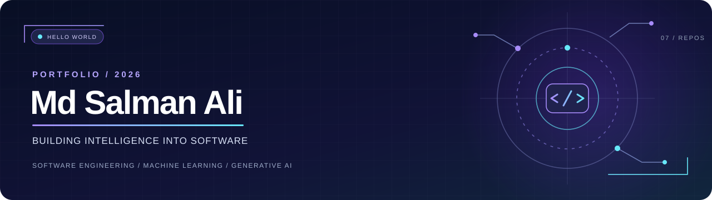

<!-- A self-hosted profile: no fragile external hero or statistics widgets. -->
<div align="center">



### `> hello_world();` 👋

**CSE (Data Science) @ Jamia Millia Islamia · New Delhi, India**

I turn ideas into working software — from **AI agents and RAG** to **computer vision and ML-powered applications**.

[](https://github.com/alisalmann7386-crypto?tab=repositories)
[](https://www.linkedin.com/in/md-salman-ali-8a301a324/)

[ABOUT](#-about-me) · [TOOLKIT](#-my-toolkit) · [PROJECTS](#-selected-builds) · [CONNECT](#-lets-connect)

</div>

---

## 🧑‍💻 About me

```python
class Salman:
    university = "Jamia Millia Islamia"
    degree = "B.Tech — Computer Science (Data Science)"
    building = ["AI agents", "RAG applications", "ML-powered software"]
    exploring = ["LLM evaluation", "system design", "MLOps"]

    def approach(self):
        return "Research → Build → Test → Improve"
```

I enjoy the intersection of **software engineering and applied AI**: designing useful workflows, connecting models to APIs, and shipping applications people can actually try. I’m interested in **software, ML, and AI research internships**.

> **Current focus:** Better LLM evaluation, reliable agent workflows, DSA, and system design.

---

## ⚡ My toolkit

| Layer | Technologies and concepts |
| :-- | :-- |
| **Languages** | Python · C++ · C · SQL |
| **AI / LLMs** | LangChain · Mistral AI · Groq · Hugging Face · RAG · multi-agent systems |
| **ML / vision** | Scikit-learn · TensorFlow / Keras · NumPy · Pandas · CNNs |
| **Apps / backend** | FastAPI · Streamlit · REST APIs · Pydantic |
| **Tools / data** | Git · GitHub · Docker · ChromaDB · FAISS · Jupyter |

---

## 🛰️ Selected builds

*Real repositories, real problem statements, and direct links to the code.*

### `01` 🤖 Multi-Agent Research System

**A research workflow with specialized AI agents.** An orchestrator coordinates search, research, analysis, and synthesis to produce structured, source-oriented responses.

`Python` `LangChain` `Mistral AI` `Tavily` · **Explore:** agent orchestration, information retrieval, report generation

[**↗ Source code**](https://github.com/alisalmann7386-crypto/Multi-agent-research-system) · [**↗ Live demo**](https://multi-agent-research-system-salman.streamlit.app/)

### `02` 🎬 AI Video Assistant

**Make long videos searchable.** Processes YouTube links or uploaded media, transcribes audio, summarizes content, and answers questions using retrieval-augmented generation.

`Python` `Streamlit` `LangChain` `yt-dlp` · **Explore:** transcription, embeddings, semantic retrieval, LLM integration

[**↗ Source code**](https://github.com/alisalmann7386-crypto/AI-VIDEO-ASSISTANT)

### `03` 🌿 AgroVision AI — Plant Disease Detection

**Computer vision for plant health.** Uses a CNN to classify leaf images across 38 healthy-plant and disease classes, with confidence visualization and downloadable reports.

`TensorFlow` `Keras` `CNN` `Streamlit` · **Explore:** image preprocessing, deep learning, inference UX

[**↗ Source code**](https://github.com/alisalmann7386-crypto/Plant-Disease-Detection) · [**↗ Live demo**](https://plant-disease-detection-s.streamlit.app/)

### `04` 🌾 Smart Agriculture AI

**Crop recommendations from soil and weather data.** Uses a Random Forest classifier, integrates weather information, and displays crop suggestions and prediction visualizations.

`Scikit-learn` `Random Forest` `Streamlit` `OpenWeather API` · **Explore:** applied ML, API integration, data visualization

[**↗ Source code**](https://github.com/alisalmann7386-crypto/Smart-Agriculture-AI) · [**↗ Live demo**](https://smart-agriculture-ai-salman.streamlit.app/)

<details>
<summary><b>＋ Open the rest of my project lab</b></summary>

| Project | What it explores |
| :-- | :-- |
| [❤️ Heart Disease Prediction](https://github.com/alisalmann7386-crypto/heart-disease-prediction-ml) | SVM classification and a Streamlit interface for risk estimates |
| [🧠 Mental Health Score Predictor](https://github.com/alisalmann7386-crypto/Mental-Health-Score) | An ML prediction pipeline served with FastAPI; not a clinical diagnostic tool |
| [📺 YT Video Assistant](https://github.com/alisalmann7386-crypto/YT-VIDEO-ASSISTANT) | Video transcription, summaries, action items, and RAG Q&A |

</details>

---

## 🧭 How I build

```text
  UNDERSTAND          DESIGN            BUILD             VALIDATE
      ● ─────────────── ● ─────────────── ● ─────────────── ●
  Problem + data    Architecture      Model + API       Test + iterate
                                            │
                                            └──────→ Share & improve ↗
```

I'm especially interested in making AI applications **useful, understandable, and reliable**, not just getting a model to produce an answer.

---

## 🤝 Let's connect

**Open to conversations about software engineering, machine learning, AI research, and collaborative projects.**

[**LinkedIn ↗**](https://www.linkedin.com/in/md-salman-ali-8a301a324/) · [**All repositories ↗**](https://github.com/alisalmann7386-crypto?tab=repositories)

<div align="center">

---

`while (curious) { learn(); build(); improve(); }`

**Thanks for stopping by. ✨**

</div>
