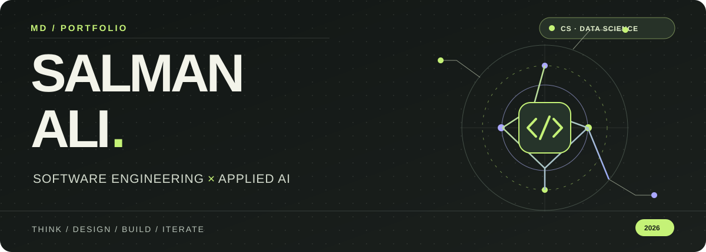

<!-- Md Salman Ali | self-hosted hero; no dependency on third-party stats or animation services. -->
<p align="center">
  
</p>

<p align="center">
  <strong>Hi, I'm Salman.</strong> I build AI-powered products, experiment with machine learning, and turn research ideas into usable software.
  <br/><br/>
  <a href="https://github.com/alisalmann7386-crypto?tab=repositories"></a>
  <a href="https://www.linkedin.com/in/md-salman-ali-8a301a324/"></a>
</p>

<p align="center"><sub>BASED IN NEW DELHI, INDIA &nbsp; / &nbsp; B.TECH CSE (DATA SCIENCE) @ JAMIA MILLIA ISLAMIA</sub></p>

---

### 01 &nbsp; / &nbsp; THE SHORT VERSION

> **I work at the intersection of software engineering and applied AI.** My projects range from multi-agent research and video RAG to computer vision and predictive machine learning. I care about building systems that are useful, understandable, and testable.

**Currently exploring:** LLM evaluation · agent reliability · data structures & algorithms · system design · MLOps  
**Interested in:** software engineering, machine learning, and AI research internships

---

### 02 &nbsp; / &nbsp; SELECTED WORK

These are real projects from my repositories. Each one has a different technical focus.

#### `01` &nbsp; MULTI-AGENT RESEARCH SYSTEM &nbsp; ↗

**A team of specialized AI agents for one research question.** An orchestrator coordinates web search, research, analysis, and synthesis into a structured report.

`LangChain` `Mistral AI` `Tavily` `Python`  
**Focus:** agent orchestration · tool use · information retrieval

[**VIEW CODE ↗**](https://github.com/alisalmann7386-crypto/Multi-agent-research-system) &nbsp; · &nbsp; [**OPEN DEMO ↗**](https://multi-agent-research-system-salman.streamlit.app/)

---

#### `02` &nbsp; AI VIDEO ASSISTANT &nbsp; ↗

**Ask questions about a video instead of searching through it manually.** Processes YouTube links or uploaded media, transcribes audio, summarizes it, and supports transcript-grounded Q&A with RAG.

`Python` `Streamlit` `LangChain` `yt-dlp`  
**Focus:** speech-to-text · embeddings · semantic retrieval · LLM integration

[**VIEW CODE ↗**](https://github.com/alisalmann7386-crypto/AI-VIDEO-ASSISTANT)

---

#### `03` &nbsp; AGROVISION AI &nbsp; ↗

**Computer vision for plant health.** A CNN classifies leaf images across 38 healthy-plant and disease classes, with confidence visualizations and downloadable reports.

`TensorFlow` `Keras` `CNN` `Streamlit`  
**Focus:** image preprocessing · deep learning inference · model UX

[**VIEW CODE ↗**](https://github.com/alisalmann7386-crypto/Plant-Disease-Detection) &nbsp; · &nbsp; [**OPEN DEMO ↗**](https://plant-disease-detection-s.streamlit.app/)

---

#### `04` &nbsp; SMART AGRICULTURE AI &nbsp; ↗

**From soil and weather data to crop recommendations.** Uses a Random Forest model alongside weather information to produce crop suggestions and interactive visualizations.

`Scikit-learn` `Random Forest` `Streamlit` `OpenWeather API`  
**Focus:** applied ML · API integration · data visualization

[**VIEW CODE ↗**](https://github.com/alisalmann7386-crypto/Smart-Agriculture-AI) &nbsp; · &nbsp; [**OPEN DEMO ↗**](https://smart-agriculture-ai-salman.streamlit.app/)

<details>
<summary><strong>＋ EXPLORE THREE MORE BUILDS</strong></summary>
<br/>

| Project | Technical focus |
| :-- | :-- |
| [Heart Disease Prediction ↗](https://github.com/alisalmann7386-crypto/heart-disease-prediction-ml) | SVM classification and a Streamlit risk-estimation interface |
| [Mental Health Score Predictor ↗](https://github.com/alisalmann7386-crypto/Mental-Health-Score) | An ML scoring application with a FastAPI backend; not a clinical diagnostic tool |
| [YT Video Assistant ↗](https://github.com/alisalmann7386-crypto/YT-VIDEO-ASSISTANT) | Transcription, summarization, action items, and RAG-powered Q&A |

</details>

---

### 03 &nbsp; / &nbsp; WHAT I BUILD WITH

| **LANGUAGES** | **AI & MACHINE LEARNING** | **PRODUCT & BACKEND** |
| :-- | :-- | :-- |
| Python · C++ · C · SQL | LangChain · Mistral AI · Groq | FastAPI · Streamlit · REST APIs |
| Data structures & algorithms | Scikit-learn · TensorFlow · Keras | Pydantic · Git · GitHub |
| | RAG · AI agents · ChromaDB · FAISS | Docker · Jupyter Notebook |

---

### 04 &nbsp; / &nbsp; MY PROCESS

```text
  01 / UNDERSTAND   →   02 / DESIGN   →   03 / BUILD   →   04 / TEST   →   05 / IMPROVE
       Problem            System            Model + API       Evaluate         Iterate
```

I prefer a working, explainable prototype over a long list of buzzwords. My goal is to connect research, models, and good software practices.

---

### 05 &nbsp; / &nbsp; SAY HELLO

Have a research idea, an open-source project, or an internship opportunity? I'd be glad to connect.

**[LINKEDIN ↗](https://www.linkedin.com/in/md-salman-ali-8a301a324/)** &nbsp; / &nbsp; **[ALL REPOSITORIES ↗](https://github.com/alisalmann7386-crypto?tab=repositories)**

<p align="center"><br/><sub>KEEP LEARNING &nbsp; · &nbsp; KEEP BUILDING &nbsp; · &nbsp; KEEP IMPROVING</sub><br/><br/><strong>Thanks for visiting. ✳</strong></p>
