<!-- Portfolio for Md Salman Ali. Animated SVG artwork is self-hosted in /assets. -->
<p align="center">
  
</p>

<p align="center">
  
</p>

<h3 align="center">Hi, I'm Salman. 👋</h3>
<p align="center">I build AI-powered products, experiment with machine learning, and turn research ideas into usable software.</p>
<p align="center"><strong>B.Tech CSE (Data Science)</strong> · Jamia Millia Islamia · New Delhi, India</p>

<p align="center">
  <a href="https://github.com/alisalmann7386-crypto?tab=repositories"></a>
  <a href="https://www.linkedin.com/in/md-salman-ali-8a301a324/"></a>
</p>

---

### 01 / THE SHORT VERSION

> **Software engineering meets applied AI.** From multi-agent research and video RAG to computer vision and predictive ML, I enjoy building systems that are useful, understandable, and testable.

**Currently exploring** → LLM evaluation · agent reliability · data structures & algorithms · system design · MLOps  
**Interested in** → software engineering · machine learning · AI research internships

---

### 02 / THE PROJECT LAB 🧪

*Four different problems. Four different ways of combining models with real applications.*

#### `01` 🤖 MULTI-AGENT RESEARCH SYSTEM

**Research with a team of specialized AI agents.** An orchestrator coordinates web search, research, analysis, and synthesis to produce a structured report.

`LangChain` `Mistral AI` `Tavily` `Python`  
**Explore:** orchestration · tool use · information retrieval

[**SOURCE CODE ↗**](https://github.com/alisalmann7386-crypto/Multi-agent-research-system) · [**LIVE DEMO ↗**](https://multi-agent-research-system-salman.streamlit.app/)

---

#### `02` 🎬 AI VIDEO ASSISTANT

**Make videos searchable.** Process YouTube links or uploaded media, transcribe and summarize audio, then ask questions about the content through RAG.

`Python` `Streamlit` `LangChain` `yt-dlp`  
**Explore:** transcription · embeddings · semantic search

[**SOURCE CODE ↗**](https://github.com/alisalmann7386-crypto/AI-VIDEO-ASSISTANT)

---

#### `03` 🌿 AGROVISION AI

**Computer vision for plant health.** A CNN classifies leaf images across 38 healthy-plant and disease classes, with confidence visualizations and downloadable reports.

`TensorFlow` `Keras` `CNN` `Streamlit`  
**Explore:** image preprocessing · deep learning inference · model UX

[**SOURCE CODE ↗**](https://github.com/alisalmann7386-crypto/Plant-Disease-Detection) · [**LIVE DEMO ↗**](https://plant-disease-detection-s.streamlit.app/)

---

#### `04` 🌾 SMART AGRICULTURE AI

**From soil data to crop recommendations.** Uses a Random Forest model and weather information to produce crop suggestions and interactive visualizations.

`Scikit-learn` `Random Forest` `Streamlit` `OpenWeather API`  
**Explore:** applied ML · API integration · visualization

[**SOURCE CODE ↗**](https://github.com/alisalmann7386-crypto/Smart-Agriculture-AI) · [**LIVE DEMO ↗**](https://smart-agriculture-ai-salman.streamlit.app/)

<details>
<summary><strong>✦ Open three more builds</strong></summary>

| Project | Technical focus |
| :-- | :-- |
| [❤️ Heart Disease Prediction](https://github.com/alisalmann7386-crypto/heart-disease-prediction-ml) | SVM classification with a Streamlit risk-estimation interface |
| [🧠 Mental Health Score Predictor](https://github.com/alisalmann7386-crypto/Mental-Health-Score) | ML scoring application with FastAPI; not a clinical diagnostic tool |
| [📺 YT Video Assistant](https://github.com/alisalmann7386-crypto/YT-VIDEO-ASSISTANT) | Transcription, summaries, action items and RAG-based Q&A |

</details>

---

### 03 / THE TOOLKIT ⚡

| Layer | Technologies |
| :-- | :-- |
| **Languages** | Python · C++ · C · SQL |
| **AI & LLMs** | LangChain · Mistral AI · Groq · Hugging Face · RAG · AI agents |
| **ML & vision** | Scikit-learn · TensorFlow / Keras · NumPy · Pandas · CNNs |
| **Product & backend** | FastAPI · Streamlit · REST APIs · Pydantic |
| **Tools & data** | Git · GitHub · Docker · ChromaDB · FAISS · Jupyter |

---

### 04 / HOW I BUILD 🧭

```text
 UNDERSTAND   →   DESIGN   →   BUILD   →   TEST   →   IMPROVE
   Problem       System      Model+API    Evaluate     Iterate
```

I care about connecting research and models to good software practices—not just getting a model to produce an answer.

---

### 05 / SAY HELLO ✳

Have a research idea, an open-source project, or an internship opportunity? I'd be glad to connect.

**[LINKEDIN ↗](https://www.linkedin.com/in/md-salman-ali-8a301a324/)** · **[ALL REPOSITORIES ↗](https://github.com/alisalmann7386-crypto?tab=repositories)**

<p align="center"><sub>KEEP LEARNING · KEEP BUILDING · KEEP IMPROVING</sub><br/><br/><strong>Thanks for visiting. ✨</strong></p>
