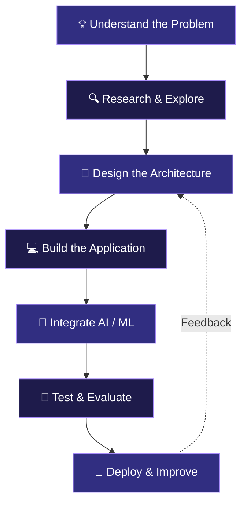

<!-- ═══════════════════════════════════════════════════════ -->
<!--                  MD SALMAN ALI                         -->
<!--               GITHUB PROFILE README                    -->
<!-- ═══════════════════════════════════════════════════════ -->

<div align="center">


### ⚡ AI DEVELOPER · SOFTWARE ENGINEER · CREATIVE THINKER


<br/>

[](https://github.com/alisalmann7386-crypto)
[](https://www.linkedin.com/in/md-salman-ali-8a301a324/)
[](https://github.com/alisalmann7386-crypto?tab=repositories)

<br/>


</div>

---

## `01 / WHO AM I?`

```python
class Salman:
    def __init__(self):
        self.name = "Md Salman Ali"
        self.education = "B.Tech CSE (Data Science)"
        self.university = "Jamia Millia Islamia"

        self.interests = [
            "Generative AI",
            "Multi-Agent Systems",
            "Machine Learning",
            "Computer Vision",
            "Software Engineering"
        ]

        self.mission = "Build intelligent systems that matter"

    def current_focus(self):
        return [
            "LLMs and Retrieval-Augmented Generation",
            "Advanced DSA and System Design",
            "Building and evaluating AI applications"
        ]
```

I'm a Computer Science undergraduate who enjoys connecting the dots between **machine learning, software engineering, and real-world applications.**

From designing multi-agent research workflows to building computer vision applications, I like exploring how intelligent systems work and turning that understanding into software.

> I don't just want to understand how AI works. I want to build useful things with it.

---

## `02 / MY TECH UNIVERSE`

<div align="center">

### ⌨️ Languages


### 🧠 Machine Learning & Deep Learning


`NumPy` `Pandas` `Keras` `CNNs` `Model Evaluation`

### 🤖 Generative AI


`LangChain` `Mistral AI` `Groq` `Hugging Face`

`RAG` `AI Agents` `ChromaDB` `FAISS`

### ⚙️ Backend & Tools


`Streamlit` `REST APIs` `Jupyter Notebook` `SQL`

</div>

---

## `03 / THE PROJECT LAB`

<div align="center">

### 🚀 From ideas to working applications

*Each project represents a different problem, experiment, and learning experience.*

</div>

<table>
<tr>
<td width="50%" valign="top">

### 🤖 Multi-Agent Research System

**An AI research team inside an application.**

A research assistant designed around specialized agents that search, analyze, and synthesize information.

**What it explores:**
- Multi-agent orchestration
- Automated web research
- LLM-based analysis
- Structured report generation

**Tech:** LangChain · Mistral AI · Tavily

<br/>

[](https://github.com/alisalmann7386-crypto/Multi-agent-research-system)
[](https://multi-agent-research-system-salman.streamlit.app/)

</td>
<td width="50%" valign="top">

### 🎬 AI Video Assistant

**Turn videos into searchable knowledge.**

An intelligent media analysis application combining transcription, summarization, and retrieval-augmented generation.

**What it explores:**
- Speech-to-text processing
- Transcript chunking
- Semantic retrieval
- Context-aware question answering

**Tech:** Python · LangChain · Streamlit · LLMs

<br/>

[](https://github.com/alisalmann7386-crypto/AI-VIDEO-ASSISTANT)

</td>
</tr>
<tr>
<td width="50%" valign="top">

### 🌿 AgroVision AI

**Computer vision meets agriculture.**

A CNN-powered application that classifies plant diseases from leaf images and provides relevant disease information.

**What it explores:**
- Deep learning
- Image preprocessing
- Classification across 38 classes
- Prediction visualization

**Tech:** TensorFlow · Keras · CNN · Streamlit

<br/>

[](https://github.com/alisalmann7386-crypto/Plant-Disease-Detection)
[](https://plant-disease-detection-s.streamlit.app/)

</td>
<td width="50%" valign="top">

### 🌾 Smart Agriculture AI

**Data-driven crop recommendations.**

A machine learning application that combines soil information and environmental conditions to recommend suitable crops.

**What it explores:**
- Random Forest classification
- Real-time weather integration
- Crop recommendation
- Interactive visualizations

**Tech:** Scikit-learn · Streamlit · Weather API

<br/>

[](https://github.com/alisalmann7386-crypto/Smart-Agriculture-AI)
[](https://smart-agriculture-ai-salman.streamlit.app/)

</td>
</tr>
</table>

### 🧩 More Experiments

| Project | What I Built | Source |
|:---|:---|:---:|
| ❤️ Heart Disease Prediction | SVM-based prediction application | [Code](https://github.com/alisalmann7386-crypto/heart-disease-prediction-ml) |
| 🧠 Mental Health Score Predictor | ML application with a FastAPI backend | [Code](https://github.com/alisalmann7386-crypto/Mental-Health-Score) |
| 📺 YT Video Assistant | Transcription, summarization, and RAG | [Code](https://github.com/alisalmann7386-crypto/YT-VIDEO-ASSISTANT) |

---

## `04 / INSIDE MY AI WORKFLOW`

<div align="center">

*How I approach building intelligent applications.*

</div>



---

## `05 / CURRENTLY EXPLORING`

```text
╔══════════════════════════════════════════════╗
║           THE LEARNING ROADMAP               ║
╠══════════════════════════════════════════════╣
║                                              ║
║  01  Advanced Data Structures & Algorithms   ║
║  02  Low-Level Design & System Design        ║
║  03  LLM Evaluation & Agentic Workflows      ║
║  04  MLOps & Model Deployment                ║
║  05  Applied AI Research                     ║
║                                              ║
╚══════════════════════════════════════════════╝
```

---

## `06 / GITHUB SIGNALS`

<div align="center">


</div>

---

## `07 / LET'S BUILD SOMETHING`

<div align="center">

### Have an interesting idea, research problem, or project?

I'm interested in opportunities involving **Software Engineering, Machine Learning, Generative AI, and AI Research.**

<br/>

[](https://www.linkedin.com/in/md-salman-ali-8a301a324/)
[](https://github.com/alisalmann7386-crypto?tab=repositories)

<br/>

### `while (curious) { learn(); build(); improve(); }`


</div>
